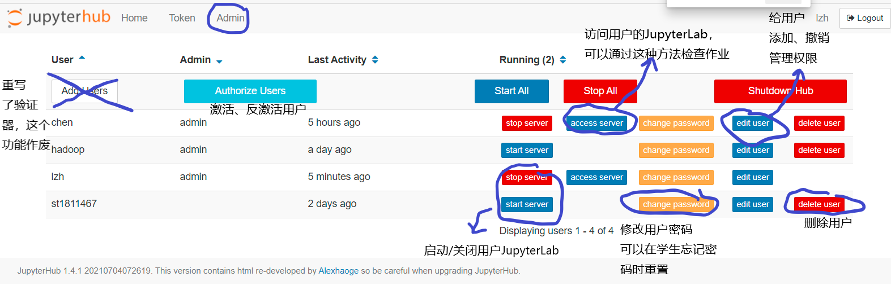

# 管理JupyterHub
## 前台管理JupyterHub
从jupyterlab界面的菜单栏点击Hub Control Panel或者{{config.extra.site_ip}}:9500/hub/admin访问管理面版  


管理界面如下(右键可以在新的页面打开图片，查看大图)



+ Authorize Users：激活、反激活用户。新注册用户需要管理员授权激活，反激活后用户无法登陆，但数据仍然保留。
+ Start/Stop Server： 启动关闭用户的JupyterHub
+ Access Server：访问用户的JupyterHub，可以通过这种方式协助学生调试
+ change password：修改用户密码，这在学生忘记密码需要重置时非常有用（也可直接访问{{config.extra.site_ip}}:9500/hub/change-password/用户名）
+ edit user： 修改用户名，添加管理权限
+ delete user：删除用户，连带会删除系统用户和该用户所有数据（可能hdfs数据还会保留）
+ Add Users：因为jupyterhub的登陆验证器重新开发，这个添加用户功能目前基本上不起作用，不应该使用，新增用户应由用户自行注册后管理员审核通过产生。

### 授权激活/反激活用户
管理界面点击"Authorize Users"或访问[http://{{config.extra.site_ip}}/hub/authorize](http://{{config.extra.site_ip}}/hub/authorize)可以激活新注册用户，或者反激活一个用户使其无法登陆，界面中的discard等价于删除用户，连带会删除系统用户和该用户所有数据（可能hdfs数据还会保留）


## JupyterHub的后台配置
jupyterhub需要以root身份启动，原始命令如下
```
conda activate jupyterhub
jupyterhub -f /etc/jupyterhub/jupyterhub_config.py
```
-f后面的是配置文件路径，对默认配置做了一些修改，可以在服务器上查看并参考https://jupyterhub.readthedocs.io/en/stable/reference/config-reference.html。  
另外运行时的数据保存还需要  

+ 一个数据库，存储在/var/jupyterhub/jupyterhub.sqlite
+ 一个保存用户登陆状态的cookie，存储在/var/jupyterhub/jupyterhub_cookie_secret
+ 一个记录jupyterhub进程号的pid文件，存储在/var/jupyterhub/jupyterhub_proxy.pid 

这些在配置文件/etc/jupyterhub/jupyterhub_config.py中都有体现。

### JupyterHub配置为自启动service
但实际上目前不是这样启动的，我们将jupyterhub注册为一个系统的服务（service），并由systemctl自动启动
注册服务的配置文件存储在/etc/systemd/system/jupyterhub.service
```
[Unit]
Description=分布式存储与计算课程JupyterHub
Documentation=https://jupyterhub.readthedocs.io/en/stable/index.html
After=syslog.target network.target

[Service]
User=root
Environment="PATH=/bin:/usr/local/sbin:/usr/local/bin:/usr/sbin:/usr/local/anaconda3/envs/jupyter/bin"
ExecStart=/usr/local/anaconda3/envs/jupyter/bin/jupyterhub -f /home/hadoop/jupyterhub_config.py
Restart=on-failure

[Install]
WantedBy=multi-user.target
```
管理命令为使用sudo或root身份的systemctl命令
```shell
systemctl start/stop jupyterhub # 启动、停止
systemctl status jupyterhub # 查看状态及最近的日志
systemctl restart jupyterhub # 重启
systemctl enable/disable jupyterhub # 开机启动/不启动jupyterhub
```
### 使用native authenticator并自定义修改
对于JupyterHub的用户验证，我们使用[NativeAuthenticator](https://native-authenticator.readthedocs.io/en/latest/)，而且为了绑定系统用户的注册和删除，做了一些修改，重写了这个扩展，源代码在[github](https://github.com/Alexhaoge/nativeauthenticator)。  

因此安装这个自定义的用户认证模块时，不能直接使用pip从pypi上下载，而应该先从github的代码仓库克隆，然后使用代码中的setup.py，即setuptools本地安装
```shell
git clone https://github.com/Alexhaoge/nativeauthenticator.git
cd nativeauthenticator
conda activate jupyterhub
python setup.py install
```
目前仓库已经下载到/home/hadoop/nativeauthenticator，更新的话git pull即可

## 添加管理员
由于JupyterHub自动创建的新用户用户名是st开头的，家目录在/data/home/stxxxxx下，管理员用户需要命令行手动创建
1. 创建Linux系统用户
```shell
useradd -m -s /bin/bash new_user
```
2. 修改JupyterHub配置文件`/etc/jupyterhub/jupyterhub_config.py`，可以通过vim打开
`vim /etc/jupyterhub/jupyterhub_config.py`；找到`c.Authenticator.admin_users`，添加新建的用户名；
```python
c.Authenticator.admin_users = {'chen', 'alice', 'bob', 'new_user'}
```
这个配置文件很长，如果找不到选项可以使用vim搜索功能，先按`Esc`进入vim命令模式再输入`/admin_users`回车即可找到，之后按`i`进入编辑模式，完成编辑后`Esc`进入命令模式，输入`:wq`保存退出。
3. 重启JupyterHub
4. 在JupyterHub前台见面完成注册流程，用户名密码与刚创建的linux用户一致
5. 使用新创建的管理员账户登陆