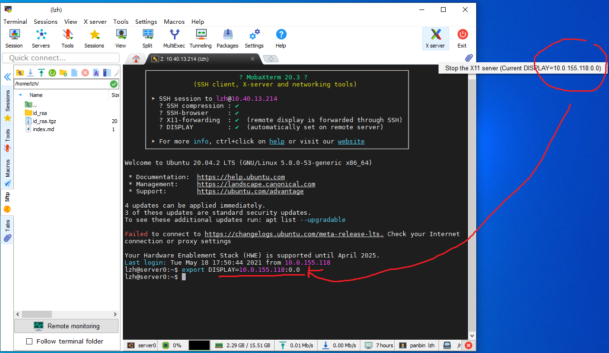
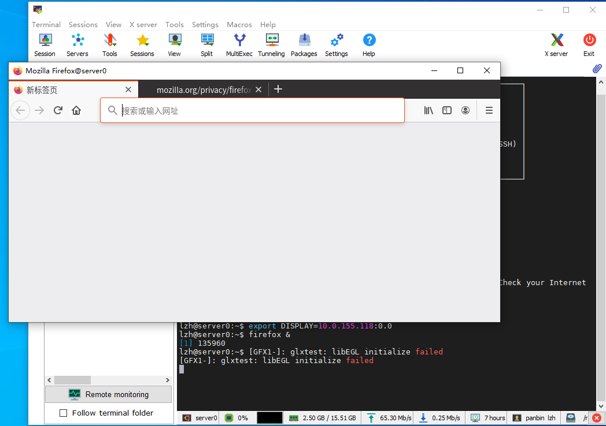

# SSH及Linux常用命令
每个JupyterHub账号关联了一个服务器上的Linux账号，所以一些JupyterLab上不方便做的操作，也可以通过SSH登陆服务器直接在Linux上操作
## SSH
Windows10、Linux、MacOS可以直接在cmd/Powershell/Terminal中输入ssh命令登陆
```shell
ssh -p 端口号 -i 密钥文件路径 用户名@10.40.13.202
```
出于安全考虑，我们修改了ssh的一些配置，管理员请单独联系老师或文档编写者获取新配置下的登陆方法

### SSH免密登陆配置
两种方法：
1. 自己现有ssh公钥直接追加到`~/.ssh/authorized_keys`中
2. 新建服务器用户的ssh公私钥，将公钥添加到`authorized_keys`，下载私钥到个人电脑。
```
ssh-keygen
# 按提示连按三次回车
cat ~/.ssh/id_rsa.pub >> ~/.ssh/authorized_keys
# 下载~/.ssh/id_rsa
```

### SSH客户端 MobaXterm
推荐在windows上使用的mobaxterm而不是命令行，[官网](https://mobaxterm.mobatek.net/download-home-edition.html)可能下载比较慢，服务器上保存了安装包

配置步骤
1. 打开MobaXterm，点击session按钮新建一个会话，选择ssh


2. 如图所示在对应位置填入ip地址、用户名、端口号和密钥文件在你电脑上的路径


3. 完成配置，这个会话会出现在左侧session侧边栏中，双击即可打开ssh连接
4. 如需访问图形化界面，将鼠标放置于MobaXterm**右上角X图标**上，会显示一个xxx.xxx.xxx.xxx:0.0的值，将当前ssh会话的DISPLAY环境变量修改为与这个值即可



## Linux常用命令
[Linux常用命令大全](https://www.runoob.com/linux/linux-command-manual.html)

+ 几乎所有的命令后面加`--help`或者前面加`man`，都可以看到用法说明
+ **绝对路径与相对路径**：以`/`开头的是从系统的根目录开始找，叫绝对路径；没有`/`的是从当前工作路径（会显示在shell的提示符上）开始从当前工作目录走到另一个目录，叫相对路径；相对路径有一些特殊符号，如`~`代表家目录，对于普通用户而言一般是`/home/用户名`，`.`表示当前目录，`..`表示上一级目录
+ `ls 路径`显示路径下的文件，-ltra查看所有文件详情
+ `cd 路劲`表示进入文件夹
+ `vim`使用Vim编辑器查看文件，关于vim教程请参考[https://www.runoob.com/linux/linux-vim.html](https://www.runoob.com/linux/linux-vim.html)
+ `top` 资源监视器，查看CPU、内存使用情况以及运行的进程
+ `ps aux`查看所有进程，通过在后面加管道命令可以检索特定的进程，比如`ps aux | grep 9888`搜索9888号进程，当然了grep是字符串搜索，如果进程包含9888的字样也会显示出来
+ 如果想杀掉一个进程
```shell
ps aux | grep 程序名或进程号或者你的用户名 # ps aux 显示所有进程，grep从中搜索你输入的关键字
# 返回的第一列是进程号
kill -9 进程号
```
+ 后台运行一个程序
```shell
nohup 命令 >output.log 2>&1  &
# >output.log 表示将输出日志重定向到output.log
# 2>&1 表示将错误信息重定向到这个日志，这样如果程序异常中断了traceback也会记录下来
```