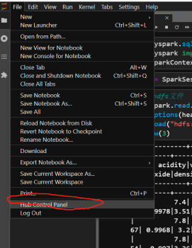
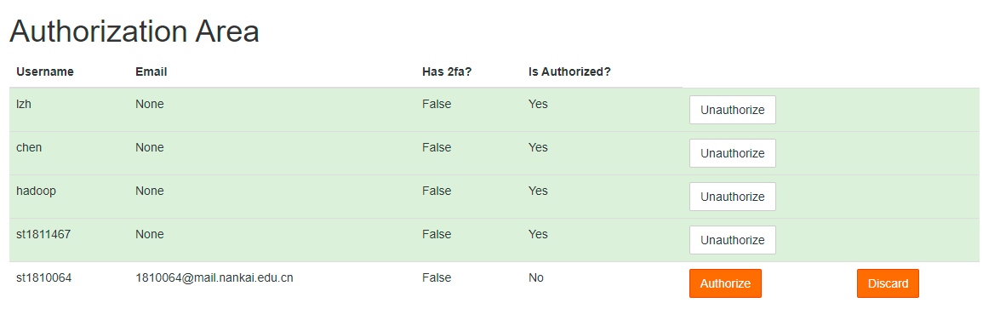

# 管理员手册
为方便日后维护和迁移，在此记录一些jupyterhub和Spark的配置方法

## 管理Spark和HDFS
### 启动和关闭
Spark和Hadoop的部署其实可配置的东西很复杂，但是多数教学用不到而且毕竟麻烦，所以我们只启动最简单的Spark Standalone和HDFS
```shell
$SPARK_HOME/sbin/start-all.sh # 启动spark
$SPARK_HOME/sbin/stop-all.sh # 关闭spark
$HADOOP_HOME/sbin/start-dfs.sh # 启动hdfs
$HADOOP_HOME/sbin/stop-dfs.sh # 关闭hdfs
# 如果环境变量没有找到上面的脚本，输入source /etc/profile
```
spark和hadoop配置成系统服务比较困难，目前加到了开机项，但不保证遇到一些特殊原因会自行关闭，如果发现连接不上，需要手动启动。
### WebUI
HDFS 10.40.13.202:50070  
Spark 10.40.13.202:8080  
10.40.13.202:4040,4041,4042,...
### 安装配置
这部分网上的教程很多，主要就是这几个步骤

+ 拷贝ssh密钥配置免密
+ 下载软件
+ 修改环境变量配置JAVA_HOM/HADOOP_HOME/SPARK_HOME
+ 修改Spark和Hadoop自身配置
    - 对于spark主要是$SPARK_HOME/conf/spark-env.sh配置好一些变量
    - 对于hadoop是$HADOOP_HOME/etc/hadoop/，这里比较复杂需要参考网上教程，然后初始化namenode
+ 用安装目录sbin文件夹内的脚本启动服务
+ Jps查看已启动进程判断是否成功，HDFS是看到namenode、secondarynamenode、datanode各一个，Spark是看到Master和Worker各一个

环境变量修改/etc/profile直接为所有用户配置比较省事，但保险起见spark和hadoop自己的环境变量仍要写一遍：

```shell
export JAVA_HOME="/usr/lib/jvm/java-1.8.0-openjdk"
export HADOOP_HOME="/usr/local/hadoop"
export SPARK_HOME="/usr/local/spark"
export SCALA_HOME="/usr/share/scala"
export CLASSPATH="$CLASSPATH:$JAVA_HOME/lib/dt.jar:$JAVA_HOME/lib/tools.jar"
export HIVE_HOME="/usr/local/hive"
export HADOOP_CLASSPATH="$JAVA_HOME/lib/tools.jar:$HADOOP_CLASSPATH"
export PATH="$PATH:/usr/local/bin:/usr/local/sbin:/usr/bin:/usr/sbin:/root/bin:$JAVA_HOME/bin:/usr/local/anaconda3/bin:$HADOOP_HOME/bin:$SPARK_HOME/bin:$HIVE_HOME/bin"
export COURSIER_CACHE="/usr/share/coursier/cache" # 这个是Scala的第三方库下载位置
```

## 前台管理JupyterHub
从jupyterlab界面的菜单栏点击Hub Control Panel或者10.40.13.202:9500/hub/admin访问管理面版  



管理界面如下(右键可以在新的页面打开图片，查看大图)


+ Authorize Users：激活、反激活用户。新注册用户需要管理员授权激活，反激活后用户无法登陆，但数据仍然保留。
+ Start/Stop Server： 启动关闭用户的JupyterHub
+ Access Server：访问用户的JupyterHub，可以通过这种方式协助学生调试
+ change password：修改用户密码，这在学生忘记密码需要重置时非常有用（也可直接访问10.40.13.202:9500/hub/change-password/用户名）
+ edit user： 修改用户名，添加管理权限
+ delete user：删除用户，连带会删除系统用户和该用户所有数据（可能hdfs数据还会保留）
+ Add Users：因为jupyterhub的登陆验证器重新开发，这个添加用户功能目前基本上不起作用，不应该使用，新增用户应由用户自行注册后管理员审核通过产生。

### 授权激活/反激活用户
管理界面点击"Authorize Users"或访问[http://10.40.13.202/hub/authorize](http://10.40.13.202/hub/authorize)可以激活新注册用户，或者反激活一个用户使其无法登陆，界面中的discard等价于删除用户，连带会删除系统用户和该用户所有数据（可能hdfs数据还会保留）



## JupyterHub的后台配置
jupyterhub需要以root身份启动，原始命令如下
```
conda activate jupyterhub
jupyterhub -f /home/hadoop/jupyterhub_config.py
```
-f后面的是配置文件路径，对默认配置做了一些修改，可以在服务器上查看并参考https://jupyterhub.readthedocs.io/en/stable/reference/config-reference.html。  
另外运行时的数据保存还需要  

+ 一个数据库，存储在/home/hadoop/jupyterhub.sqlite
+ 一个保存用户登陆状态的cookie，存储在/home/hadoop/jupyterhub_cookie_secret
+ 一个记录jupyterhub进程号的pid文件，存储在/home/hadoop/jupyterhub_proxy.pid 

这些在/home/hadoop/jupyterhub_config.py中都有体现。
### JupyterHub配置为自启动service
但实际上目前不是这样启动的，我们将jupyterhub注册为一个系统的服务（service），并systemctl管理  
注册服务的配置文件存储在/etc/systemd/system/jupyterhub.service
```
[Unit]
Description=分布式存储与计算课程JupyterHub
Documentation=https://jupyterhub.readthedocs.io/en/stable/index.html
After=syslog.target network.target

[Service]
User=root
Environment="PATH=/bin:/usr/local/sbin:/usr/local/bin:/usr/sbin:/usr/local/anaconda3/envs/jupyterhub/bin"
ExecStart=/usr/local/anaconda3/envs/jupyterhub/bin/jupyterhub -f /home/hadoop/jupyterhub_config.py
Restart=on-failure

[Install]
WantedBy=multi-user.target
```
管理命令为使用sudo或root身份的systemctl命令
```shell
systemctl start/stop jupyterhub # 启动、停止
systemctl status jupyterhub # 查看状态及最近的日志
systemctl restart jupyterhub # 重启
systemctl enable/disable jupyterhub # 开机启动/不启动jupyterhub
```
### 使用native authenticator并自定义修改
CentOS的系统上PAMAuthenticator不知道为什么就是无法通过验证，故我换用[NativeAuthenticator](https://native-authenticator.readthedocs.io/en/latest/)，而且为了绑定系统用户的注册和删除，做了一些修改，重写了这个扩展，源代码在[github](https://github.com/Alexhaoge/nativeauthenticator)。  

因此安装这个自定义的用户认证模块时，不能直接使用pip从pypi上下载，而应该先从github的代码仓库克隆，然后使用代码中的setup.py，即setuptools本地安装
```shell
git clone https://github.com/Alexhaoge/nativeauthenticator.git
cd nativeauthenticator
conda activate jupyterhub
python setup.py install
```
目前仓库已经下载到/home/hadoop/nativeauthenticator，更新的话git pull即可
### 自定义jupyterhub的html
为了方便前台修改密码和激活用户，我重写了jupyterhub的html文件，存储在`/usr/local/anaconda3/envs/jupyterhub/share/jupyterhub/templates/`，主要是修改了`admin.html`和`home.html`，如果升级jupyterhub将会覆盖这两个文件，所以升级前应做好备份。

## 关于Scala
尝试了apache-toree，无法启动kernel，提示说scala缺少类。

jupyterhub上目前的scala kernel是[almond](https://github.com/almond-sh/almond)，虽然可以正常使用，但按照官方文档的方式运行spark时，无法同时运行两个context，一个人启动kernel时，另一个人的作业完全无法进行，所以暂时不要使用。

Scala的包下载器coursier和cs都下载在/home/hadoop目录下，设置了COURSIER_CACHE，并修改这个文件夹使其对所有用户可读可写可执行，但sbt普通用户打包时仍提示权限不足

## 本文档
使用mkdocs编写，部署在nginx上，html存放位置/usr/share/nginx/html，源码在/home/hadoop