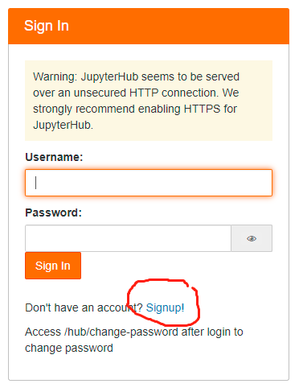
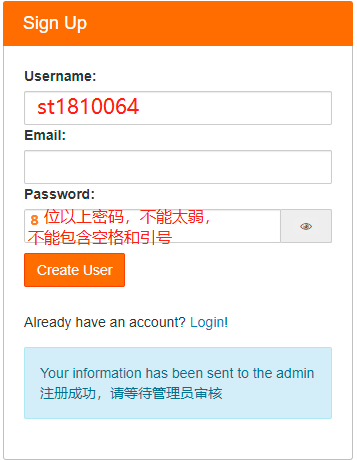
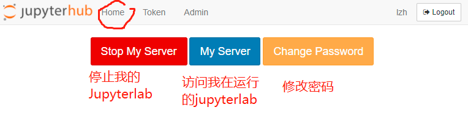

# JupyterHub使用说明
我们的主要实验环境为JupyterHub，每位同学可以申请注册单独的账号，使用一个JupyterLab，用notebook和命令行终端完成所有实验，免去大家自行安装软件的麻烦。  
链接[{{config.extra.site_ip}}:9500](http://{{config.extra.site_ip}}:9500)，只能在校园网下访问。
## 注册和登陆账号
新用户第一次访问该链接会转到登陆界面，需要点击“signup”自行注册账号  



**用户名必须使用"st"加学号**，如st1810064，密码必须**大于8位**且不能使用qwerty等弱密码，不能包含空格或冒号，注册成功时应该会遇到如下提示  



此时等待管理员审核即可，如果长时间没有通过，请联系老师和管理员。管理员通过后即可登陆。首次登陆可能会遇到如下界面后出现长时间白屏，请耐心等待，以后登陆会快很多。


## JupyterLab
我们使用的Jupyter环境为JupyterLab，比Jupyter Notebook功能更加强大，主要界面说明如下：


### 使用终端
点击左上角`+`号，并注意切换conda环境到jupyterhub`conda activate jupyter`

## 管理JupyterLab和密码
如需要重启JupyterLab或修改自己账号的密码，从jupyterlab界面的菜单栏点击Hub Control Panel访问管理面版，重启账号或修改密码，新密码仍需满足和注册时一样的要求。

**注意**：这里修改密码会同时修改对应Linux用户的密码，但是ssh时修改Linux用户的密码，Jupyterhub上的密码会保持不变。




## 更加详细的一些Jupyter教程
官方帮助
https://jupyterlab.readthedocs.io/en/latest/
仅供参考
https://cloud.tencent.com/developer/news/323834
https://zhuanlan.zhihu.com/p/38612108
https://www.cnblogs.com/zhrb/p/12174167.html

## 将自己的conda环境(不推荐)添加到jupyterhub
如果你创建了自己的conda环境（虽然非常不建议），请不要单独开启个人jupyterlab（未来可能会因为服务器防火墙无法访问，而且单独占用服务器资源和端口号），在现有的jupyterhub中注册你自己conda环境的kernel即可
1. 安装ipykernel
```shell
conda install -n 自己的环境名 ipykernel
```
如果出现http timeout或者`Solving environment: failed with initial frozen solve. Retrying with flexible solve.
`之类的错误，**多半是网络问题，请将conda源换为国内的镜像站**，具体方法百度“conda换源”

2. 激活环境
```shell
conda activate jupyterhub
```
3. 将环境写入Notebook的Kernel中
```shell
python -m ipykernel install --user --name 自己的环境名 --display-name "要显示在jupyterhub上的名字"
```
此时再打开jupyterhub应该会出现新的kernel