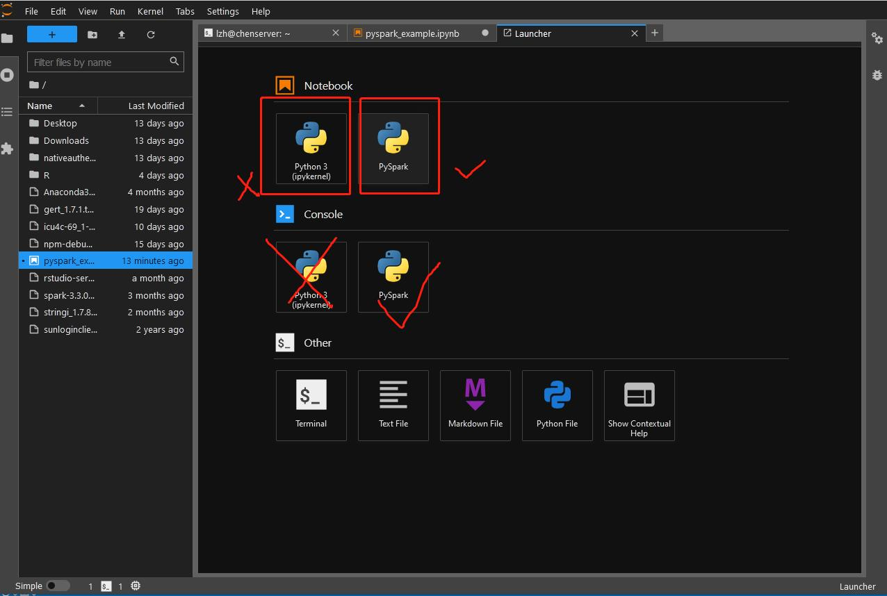
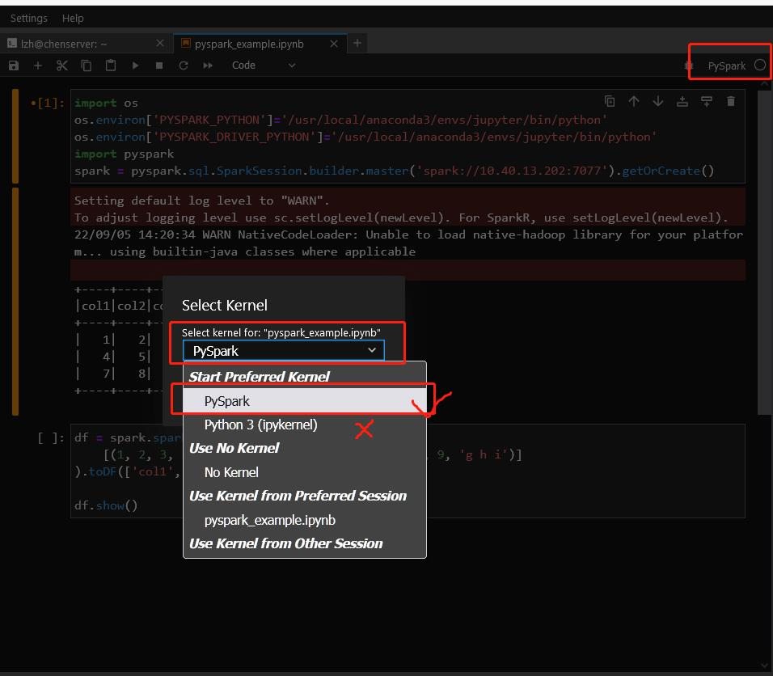
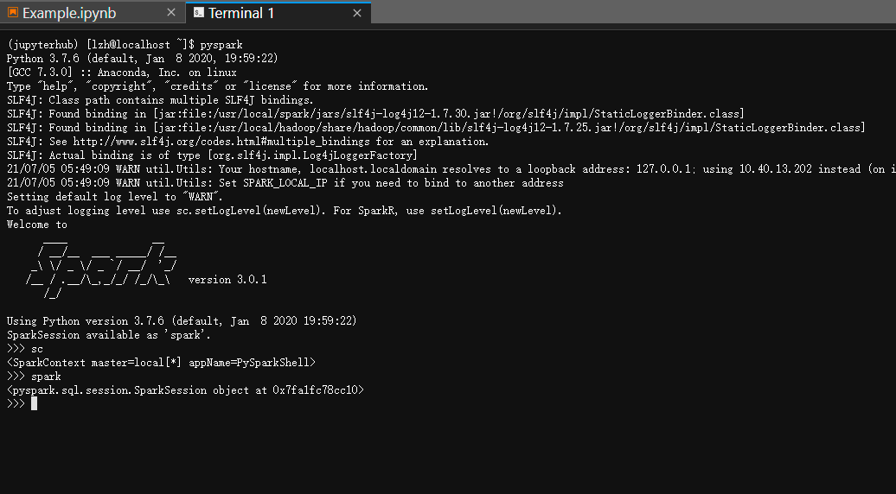

# 如何在JupyterHub上使用PySpark
PySpark已经安装到jupyterhub环境中，启动一个notebook即可访问

## 注意
请在使用完毕后务必
1. **输入Ctrl+C或者`quit()`退出pyspark交互程序**
2. **在jupyterlab侧边栏中结束所有连接spark的notebook或console进程**
3. pyspark命令行和notebook中都**不需要创建新的SparkContext**
4. **严禁指定`master`为`local[*]`**

## Notebook（推荐）
使用jupyterhub，创建一个notebook，注意要使用第二个`PySpark`的kernel，而不是第一个`Python3(ipykernel)`




jupyterhub默认的python环境中已经安装了PySpark库，无需使用findspark，通过pyspark的API可以自行创建SparkSession。

为减小服务器压力请**不要创建SparkContext**，使用pyspark.sql的API直接创建SparkSession，**并且连接到本地已有的master**，而不是自行创建新的local[*]。

下面给出一个例子，大家在使用时直接拷贝第一个单元的部分即可

```python
import os
# 这部分是指定driver和executor的python版本，必须要有不然会报错，但在pyspark交互式模式中不需要
os.environ['PYSPARK_PYTHON']='/usr/local/anaconda3/envs/jupyter/bin/python'
os.environ['PYSPARK_DRIVER_PYTHON']='/usr/local/anaconda3/envs/jupyter/bin/python'
import pyspark
# 创建spark session
spark = pyspark.sql.SparkSession.builder.master('spark://10.40.13.202:7077').getOrCreate()
```

    Setting default log level to "WARN".
    To adjust logging level use sc.setLogLevel(newLevel). For SparkR, use setLogLevel(newLevel).

    22/09/06 04:45:36 WARN NativeCodeLoader: Unable to load native-hadoop library for your platform... using builtin-java classes where applicable


```python
df = spark.sparkContext.parallelize(
    [(1, 2, 3, 'a b c'), (4, 5, 6, 'd e f'),(7, 8, 9, 'g h i')]
).toDF(['col1', 'col2', 'col3','col4'])
df.show()
```                            

    +----+----+----+-----+
    |col1|col2|col3| col4|
    +----+----+----+-----+
    |   1|   2|   3|a b c|
    |   4|   5|   6|d e f|
    |   7|   8|   9|g h i|
    +----+----+----+-----+
    


## 命令行终端
pyspark已经添加到系统路径，启动一个终端即可输入，由于服务器已有spark standalone在运行，因此启动时请直接连接到本地的master节点。默认情况下输入`pyspark`会自动连接，也通过master选项直接指定
```
pyspark --master spark://10.40.13.202:7077
```

**注意1**：**严禁指定`master`为`local[*]`**

**注意2**：pyspark中自带了**名为spark的SparkSession和sc的SparkContext**，无需也不应该额外创建



使用Ctrl+D或输入`exit()`退出

## spark-submit
用spark-submit提交一个python文件形成独立的作业，请参考[官方文档](https://spark.apache.org/docs/3.3.0/quick-start.html#self-contained-applications)

## PySpark入门
最好的方法是上课听讲、多动手写代码、出了问题查官方文档、搜索引擎及StackOverflow等。

以后有必要再补充。