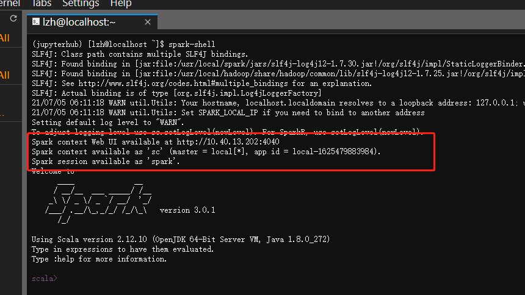

# Scala使用说明
<!-- ## 在Notebook中使用Scala Kernel
目前服务器上的Jupyter Scala Kernel仍在试验阶段，可以使用其运行一些Scala的简单代码，加载Scala基础库，但是还未安装Spark的Scala接口。未来如果配置完成，会更新此文档。 -->
## 使用普通scala
命令行中输入`scala`即可

## 使用spark-shell
spark-shell是spark启动的交互模式的Scala语言命令行，在输入命令后可以立刻查看结果

由于服务器已有spark standalone在运行，因此启动spark-shell时请直接连接到本地的master节点。默认情况下输入`spark-shell`会自动连接，也通过master选项直接指定
```
spark-shell --master spark://{{config.extra.site_ip}}:7077
```

**注意1**：**严禁指定`master`为`local[*]`**

**注意2**：spark-shell启动时自带了**名为spark的SparkSession和sc的SparkContext**，**无需也不应该额外创建SparkContext**



使用Ctrl+D退出Spark Shell
