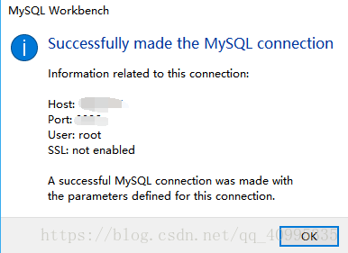
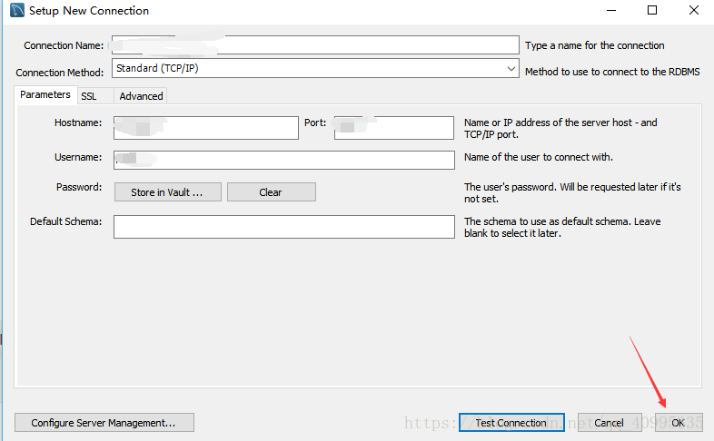

# MySQL使用说明

## 登陆MySQL
### 命令行方式
```shell
mysql -h 10.40.13.202 -P 3306 -u 用户名 -p
# 然后会有提示输入密码
# Enter password: 这里输入密码不会显示但是确实是输进去的，按回车结束
# 经过一堆欢迎界面的废话之后会显示下面这一行就代表登陆成功了
# mysql>
```
### MySQL Workbench
[教程](https://blog.csdn.net/qq_40995335/article/details/80973466)

+ 首先打开MySQL workbench 在首页点击 MySQL Connections 边上的`+`号  


+ 在弹出的框中填入相应信息  


+ 以上的  default schema表示，如果想要只默认连接某一个特定的数据库，则填上数据库的名称。然后点击测试连接，若显示  



+ 则表示测试连接成功，注意点击Test Connection 旁边的ok才会保存连接  



+ 接下来回到MySQL Workbench 的首页，会发现已经有了新的连接  

## 修改密码
学生用户在创建时的默认密码可能是一样的或比较简单，建议在首次登陆后修改密码，通过如下命令实现
```SQL
SET PASSWORD=PASSWORD(‘new_password’);
```